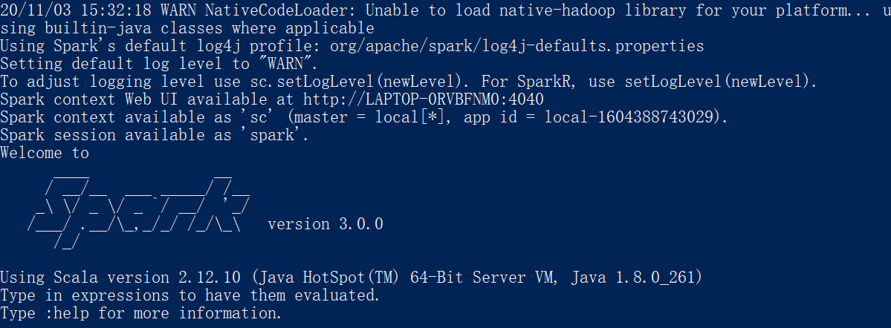
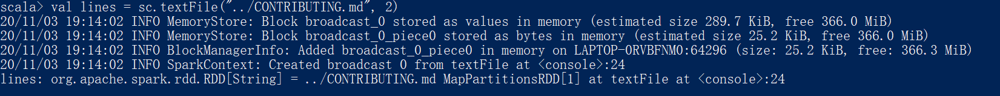
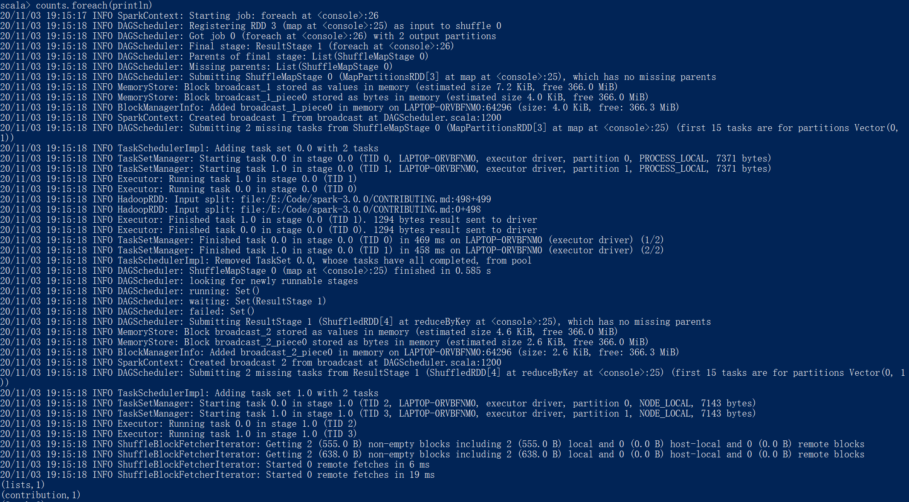
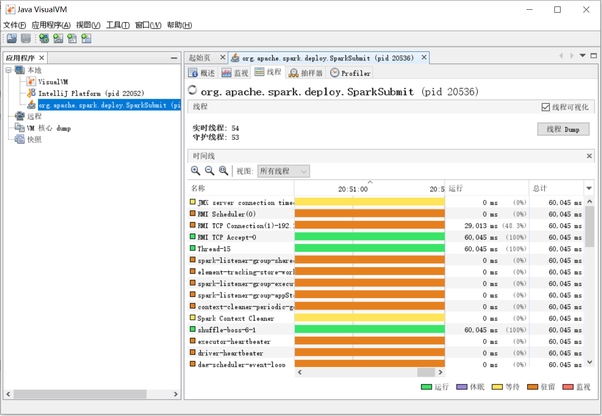

# Spark3.0 初体验

## 运行 spark-shell

在 `spark` 主目录下打开 `bin` 目录，然后双击运行 `spark-shell.cmd` ，结果如下：



<center>图1 执行 spark-shell 进入Scala命令行</center>

图1中显示了很多信息，下面进行一些说明

* 没有启动 hadoop

  ```
  20/11/03 15:32:18 WARN NativeCodeLoader: Unable to load native-hadoop library for your platform... using builtin-java classes where applicable
  ```

* 如果没有明确指定 log4j 的配置那么Spark会使用core模块下（路径为`core\src\main\resources\org\apache\spark`）的`log4j-defaults.properties` 作为 `log4j` 的默认配置。

  ```
  Using Spark's default log4j profile: org/apache/spark/log4j-defaults.properties
  Setting default log level to "WARN".
  ```

* 上面文件中设置spark-shell 日志级别为WARN，下面是文件中的一段：

  ```properties
  # Set the default spark-shell log level to WARN. When running the spark-shell, the
  # log level for this class is used to overwrite the root logger's log level, so that
  # the user can have different defaults for the shell and regular Spark apps.
  log4j.logger.org.apache.spark.repl.Main=WARN
  ```

  用户可以到spark主目录下的 `conf` 文件夹中，从 `log4j.properties.template` 复制一份 `log4j.properties` ，并在其中增加自己的配置。 

* 除了指定的 `log4j.properties` 文件外，还可以在 `spark-shell` 命令行中通过 `sc.setLogLevel(newLevel)` 语句来指定日志级别。

  ```
  To adjust logging level use sc.setLogLevel(newLevel). For SparkR, use setLogLevel(newLevel).
  ```

* SparkContext 的 `Web UI` 的地址。4040是 SparkContext 的Web UI 的默认监听端口，LAPTOP-0RVBFNM0 是主机地址

  ```
  Spark context Web UI available at http://LAPTOP-0RVBFNM0:4040
  ```

  

* 指定的部署模式（即 master 参数）为 `local[*]` 。当前应用（Application）的ID为 `local-1604388743029` 。

  ```
  Spark context available as 'sc' (master = local[*], app id = local-1604388743029).
  Spark session available as 'spark'.
  ```

  可以在 spark-shell 命令行通过 `sc` 使用SparkContext，通过 `spark` 使用 SparkSession。`sc` 和 `spark` 分别是 SparkContext 和 SparkSession 在 Spark REPL 中的变量。


在 `conf` 文件夹中，复制 `log4j.properties.template` 文件为 `log4j.properties` ，然后将其中的一行 `WARN` 改成 `INFO`，如下：

```
log4j.logger.org.apache.spark.repl.Main=INFO
```

再次运行 spark-shell，结果如下：


可以看出，运行的过程出现了：

- SparkContext
- ResourceUtils
- SecurityManager
- Utils
- SparkEnv
- BlockManagerMasterEndpoint
- DiskBlockManager
- MemoryStore
- SparkUI
- Executor
- NettyBlockTransferService
- BlockManager
- BlockManagerMaster
- BlockManagerMasterEndpoint
- Main

后面将解释这些信息


## 执行 word count

word count 是经典的统计单词个数的程序，常用于大数据框架使用的第一个例子。输入下面 scala 语句（紧跟在 `scala> ` 后面的代码）：

* 读取文件，以Spark安装目录下的 `CONTRIBUTING.md` 文件为例。



* textFile 是逐行读取的，现在以空格分割每个单词。


```scala
scala> val words = lines.flatMap(line => line.split(" "))
words: org.apache.spark.rdd.RDD[String] = MapPartitionsRDD[7] at flatMap at <console>:25
```

* 将每个单词的计数初始化为 1 。


* 对单词进行计数值的聚合。


* 将每个单词的计数值打印下来，输入 `counts.foreach(println)` ，将每个单词的计数值打印下来。




**关键的内容介绍**

* SparkContext 为提交的 Job 生成的ID为 0 。

  ```
  20/11/03 19:15:18 INFO DAGScheduler: Got job 0 (foreach at <console>:26) with 2 output partitions
  ```

* word count 例子一共产生了4个RDD（在上面代码执行过程中可以看出），被划分为一个 `ResultStage` 和一个 `ShuffleMapStage` 。`ShuffleMapStage` 的 ID 是 0 ，`ResultStage` 的 ID 是 1。

  ```
  lines: org.apache.spark.rdd.RDD[String] = ../CONTRIBUTING.md MapPartitionsRDD[1] at textFile at <console>:24
  
  words: org.apache.spark.rdd.RDD[String] = MapPartitionsRDD[2] at flatMap at <console>:25
  
  ones: org.apache.spark.rdd.RDD[(String, Int)] = MapPartitionsRDD[3] at map at <console>:25
  
  counts: org.apache.spark.rdd.RDD[(String, Int)] = ShuffledRDD[4] at reduceByKey at <console>:25
  ```

  最后一个stage，即 `Final stage` 是 `ResultStage 1` ，可以看出 `DAGScheduler` 是根据有向无环图的终点追溯各个无源起始点，然后执行。 `ShuffleMapStage 0` 是  `ResultStage 1` 的一个 “父结点”，所以查看 `ShuffleMapStage 0` ，发现 missing parent，即为起始点。

  ```
  20/11/03 19:15:18 INFO DAGScheduler: Final stage: ResultStage 1 (foreach at <console>:26)
  20/11/03 19:15:18 INFO DAGScheduler: Parents of final stage: List(ShuffleMapStage 0)
  20/11/03 19:15:18 INFO DAGScheduler: Missing parents: List(ShuffleMapStage 0)
  ```

  然后提交一个 Stage，`ShuffleMapStage` 执行完成后，`ResultStage` 便可以继续执行，如下所示：

  ```
  20/11/03 19:15:18 INFO DAGScheduler: Submitting ShuffleMapStage 0 (MapPartitionsRDD[3] at map at <console>:25), which has no missing parents
  
  20/11/03 19:15:18 INFO DAGScheduler: Submitting ResultStage 1 (ShuffledRDD[4] at reduceByKey at <console>:25), which has no missing parents
  ```

  在 Spark 中，如果Stage没有执行完成，就会多次重试，每次尝试都有一个尝试号（attempt number）。这里两个Stage的尝试号都是 0，如下面的 `stage 0.0` 和 `stage 1.0` 。

  ```
  20/11/03 19:15:18 INFO Executor: Finished task 1.0 in stage 0.0 (TID 1). 1294 bytes result sent to driver
  20/11/03 19:15:18 INFO Executor: Finished task 0.0 in stage 0.0 (TID 0). 1294 bytes result sent to driver
  
  20/11/03 19:15:18 INFO TaskSetManager: Starting task 0.0 in stage 1.0 (TID 2, LAPTOP-0RVBFNM0, executor driver, partition 0, NODE_LOCAL, 7143 bytes)
  20/11/03 19:15:18 INFO TaskSetManager: Starting task 1.0 in stage 1.0 (TID 3, LAPTOP-0RVBFNM0, executor driver, partition 1, NODE_LOCAL, 7143 bytes)
  ```

* Job 有两个分区，所以两个 Stage 都有两个Task被提交，每个 Task 也会多次尝试，每次尝试都有尝试号，例如 `task 1.0` 和 `task0.0` 。

  ```
  20/11/03 19:15:18 INFO DAGScheduler: Got job 0 (foreach at <console>:26) with 2 output partitions
  ```

* HaddoopRDD 则用于读取文件内容

  ```
  20/11/03 19:15:18 INFO HadoopRDD: Input split: file:/E:/Code/spark-3.0.0/CONTRIBUTING.md:498+499
  20/11/03 19:15:18 INFO HadoopRDD: Input split: file:/E:/Code/spark-3.0.0/CONTRIBUTING.md:0+498
  ```


## 剖析 spark-shell

这里探究 spark-shell脚本做了什么，在windows下使用的是 `spark-shell.cmd` ，这里只分析 shell 脚本。

### 脚本分析

<center>代码清单1-1 spark-shell 脚本</center>

```bash
function main() {
  if $cygwin; then
    stty -icanon min 1 -echo > /dev/null 2>&1
    export SPARK_SUBMIT_OPTS="$SPARK_SUBMIT_OPTS -Djline.terminal=unix"
    "${SPARK_HOME}"/bin/spark-submit --class org.apache.spark.repl.Main --name "Spark shell" "$@"
    stty icanon echo > /dev/null 2>&1
  else
    export SPARK_SUBMIT_OPTS
    "${SPARK_HOME}"/bin/spark-submit --class org.apache.spark.repl.Main --name "Spark shell" "$@"
  fi
}
```

这里执行了 spark-submit 脚本，下面分析 saprk-submit 脚本

<center>代码清单1-2 spark-submit 脚本</center>

```bash
if [ -z "${SPARK_HOME}" ]; then
  source "$(dirname "$0")"/find-spark-home
fi
# disable randomized hash for string in Python 3.3+
export PYTHONHASHSEED=0
exec "${SPARK_HOME}"/bin/spark-class org.apache.spark.deploy.SparkSubmit "$@"
```

spark-submit 中执行了 spark-class 脚本，打开 spark-class，看到

```bash
# Find the java binary
if [ -n "${JAVA_HOME}" ]; then
  RUNNER="${JAVA_HOME}/bin/java"
else
  if [ "$(command -v java)" ]; then
    RUNNER="java"
  else
    echo "JAVA_HOME is not set" >&2
    exit 1
  fi
fi
```

上面是为了找到 Java 命令。继续往下看。

```bash
build_command() {
  "$RUNNER" -Xmx128m $SPARK_LAUNCHER_OPTS -cp "$LAUNCH_CLASSPATH" org.apache.spark.launcher.Main "$@"
  printf "%d\0" $?
}

# Turn off posix mode since it does not allow process substitution
set +o posix
CMD=()
DELIM=$'\n'
CMD_START_FLAG="false"
while IFS= read -d "$DELIM" -r ARG; do
  if [ "$CMD_START_FLAG" == "true" ]; then
    CMD+=("$ARG")
  else
    if [ "$ARG" == $'\0' ]; then
      # After NULL character is consumed, change the delimiter and consume command string.
      DELIM=''
      CMD_START_FLAG="true"
    elif [ "$ARG" != "" ]; then
      echo "$ARG"
    fi
  fi
done < <(build_command "$@")
```

根据代码清单1-2，脚本 spark-submit 在执行 spark-class 脚本时，给 spark-class 增加了 SparkSubmit 参数。


### 远程监控

为方便在本地对Spark进程进行远程监控，在 spark-shell 脚本中找到以下配置：

```bash
SPARK_SUBMIT_OPTS="$SPARK_SUBMIT_OPTS -Dscala.usejavacp=true"
```

在windows的 spark-shell2.cmd 文件中为：

```cmd
set SPARK_SUBMIT_OPTS="%SPARK_SUBMIT_OPTS% -Dscala.usejavacp=true"
```

追加 jmx 配置：

```
-Dcom.sun.management.jmxremote -Dcom.sun.management.jmxremote.port=10207
-Dcom.sun.management.jmxremote.authenticate=false -Dcom.sun.management.jmxremote.ssl=false
```

若Spark安装在其它机器上，那么在本地打开 Java VisualVM 后需要添加远程主机。Java VisualVM 是监视 Java 线程运行状况的程序，Java11之后Java将不自带该程序，这里使用的是 Java8，只需要在命令行输入

```
jvisualvm
```

即可打开，如下：



选择右侧 `线程` 选项卡，选择 `main线程` ，然后点击 `线程 Dump` 。其中 main 线程的调用栈信息如下：

```
"main" #1 prio=5 os_prio=0 tid=0x0000022289187000 nid=0x5bb0 runnable [0x000000d9779fd000]
   java.lang.Thread.State: RUNNABLE
        at java.io.FileInputStream.readBytes(Native Method)
        at java.io.FileInputStream.read(FileInputStream.java:255)
        at java.io.BufferedInputStream.read1(BufferedInputStream.java:284)
        at java.io.BufferedInputStream.read(BufferedInputStream.java:345)
        - locked <0x00000000c0181c38> (a java.io.BufferedInputStream)
        at sun.nio.cs.StreamDecoder.readBytes(StreamDecoder.java:284)
        at sun.nio.cs.StreamDecoder.implRead(StreamDecoder.java:326)
        at sun.nio.cs.StreamDecoder.read(StreamDecoder.java:178)
        - locked <0x00000000c2d3f630> (a java.io.InputStreamReader)
        at java.io.InputStreamReader.read(InputStreamReader.java:184)
        at java.io.BufferedReader.fill(BufferedReader.java:161)
        at java.io.BufferedReader.readLine(BufferedReader.java:324)
        - locked <0x00000000c2d3f630> (a java.io.InputStreamReader)
        at java.io.BufferedReader.readLine(BufferedReader.java:389)
        at scala.tools.nsc.interpreter.SimpleReader.readOneLine(SimpleReader.scala:40)
        at scala.tools.nsc.interpreter.SimpleReader.readOneLine(SimpleReader.scala:36)
        at scala.tools.nsc.interpreter.InteractiveReader.readLine(InteractiveReader.scala:45)
        at scala.tools.nsc.interpreter.InteractiveReader.readLine$(InteractiveReader.scala:42)
        at scala.tools.nsc.interpreter.SimpleReader.readLine(SimpleReader.scala:21)
        at scala.tools.nsc.interpreter.ILoop.readOneLine(ILoop.scala:473)
        at scala.tools.nsc.interpreter.ILoop.loop(ILoop.scala:485)
        at org.apache.spark.repl.SparkILoop.process(SparkILoop.scala:239)
        at org.apache.spark.repl.Main$.doMain(Main.scala:78)
        at org.apache.spark.repl.Main$.main(Main.scala:58)
        at org.apache.spark.repl.Main.main(Main.scala)
        at sun.reflect.NativeMethodAccessorImpl.invoke0(Native Method)
        at sun.reflect.NativeMethodAccessorImpl.invoke(NativeMethodAccessorImpl.java:62)
        at sun.reflect.DelegatingMethodAccessorImpl.invoke(DelegatingMethodAccessorImpl.java:43)
        at java.lang.reflect.Method.invoke(Method.java:498)
        at org.apache.spark.deploy.JavaMainApplication.start(SparkApplication.scala:52)
        at org.apache.spark.deploy.SparkSubmit.org$apache$spark$deploy$SparkSubmit$$runMain(SparkSubmit.scala:928)
        at org.apache.spark.deploy.SparkSubmit.doRunMain$1(SparkSubmit.scala:180)
        at org.apache.spark.deploy.SparkSubmit.submit(SparkSubmit.scala:203)
        at org.apache.spark.deploy.SparkSubmit.doSubmit(SparkSubmit.scala:90)
        at org.apache.spark.deploy.SparkSubmit$$anon$2.doSubmit(SparkSubmit.scala:1007)
        at org.apache.spark.deploy.SparkSubmit$.main(SparkSubmit.scala:1016)
        at org.apache.spark.deploy.SparkSubmit.main(SparkSubmit.scala)
```

上面是执行了  `val a = 1`  scala语句后 main 线程从 `WAITING` 状态转为 `RUNNABLE` 状态。可以看出程序的调用顺序：

SparkSubmit.main $\longrightarrow$ repl.Main.main $\longrightarrow$ SparkIloop.process $\longrightarrow$ ILoop.loop


### 源码分析

Spark3.0 重写了 scala库中的 `Iloop` 的 process 方法，源码如下：

```scala
  override def process(settings: Settings): Boolean = {
    // ... 省略了函数定义
    this.settings = settings
    startup() match {
      case null => false
      case line =>
        try loop(line) match {
          case LineResults.EOF => out print Properties.shellInterruptedString
          case _ =>
        }
        catch AbstractOrMissingHandler()
        finally closeInterpreter()
        true
    }
  }

```

该函数中使用了 initializeSpark 方法，该方法如下：

```scala
  val initializationCommands: Seq[String] = Seq(
    """
    @transient val spark = if (org.apache.spark.repl.Main.sparkSession != null) {
        org.apache.spark.repl.Main.sparkSession
      } else {
        org.apache.spark.repl.Main.createSparkSession()
      }
    @transient val sc = {
      val _sc = spark.sparkContext
      if (_sc.getConf.getBoolean("spark.ui.reverseProxy", false)) {
        val proxyUrl = _sc.getConf.get("spark.ui.reverseProxyUrl", null)
        if (proxyUrl != null) {
          println(
            s"Spark Context Web UI is available at ${proxyUrl}/proxy/${_sc.applicationId}")
        } else {
          println(s"Spark Context Web UI is available at Spark Master Public URL")
        }
      } else {
        _sc.uiWebUrl.foreach {
          webUrl => println(s"Spark context Web UI available at ${webUrl}")
        }
      }
      println("Spark context available as 'sc' " +
        s"(master = ${_sc.master}, app id = ${_sc.applicationId}).")
      println("Spark session available as 'spark'.")
      _sc
    }
    """,
    "import org.apache.spark.SparkContext._",
    "import spark.implicits._",
    "import spark.sql",
    "import org.apache.spark.sql.functions._"
  )

  def initializeSpark(): Unit = {
    if (!intp.reporter.hasErrors) {
      // `savingReplayStack` removes the commands from session history.
      savingReplayStack {
        initializationCommands.foreach(intp quietRun _)
      }
    } else {
      throw new RuntimeException(s"Scala $versionString interpreter encountered " +
        "errors during initialization")
    }
  }
```

`initializeSpark` 向交互式 shell 发送了一大串代码，这些代码记录在 `initializationCommands` 序列中。首先，交互式 shell 调用 `org.apache.spark.repl.Main.createSparkSession()` 方法，创建一个 `SparkSession`，变量名为 spark。`spark` 持有 `SparkSession` 的引用，`sc` 持有 `SparkSession` 内部初始化好的 `SparkContext` 。

查看 `createSparkSession` 的实现：

```scala
  def createSparkSession(): SparkSession = {
    try {
      val execUri = System.getenv("SPARK_EXECUTOR_URI")
      conf.setIfMissing("spark.app.name", "Spark shell")
      conf.set("spark.repl.class.outputDir", outputDir.getAbsolutePath())
      if (execUri != null) {
        conf.set("spark.executor.uri", execUri)
      }
      if (System.getenv("SPARK_HOME") != null) {
        conf.setSparkHome(System.getenv("SPARK_HOME"))
      }

      val builder = SparkSession.builder.config(conf)
      if (conf.get(CATALOG_IMPLEMENTATION.key, "hive").toLowerCase(Locale.ROOT) == "hive") {
        if (SparkSession.hiveClassesArePresent) {
          sparkSession = builder.enableHiveSupport().getOrCreate()           /* 在这里创建 */
          logInfo("Created Spark session with Hive support")
        } else {
          builder.config(CATALOG_IMPLEMENTATION.key, "in-memory")
          sparkSession = builder.getOrCreate()
          logInfo("Created Spark session")
        }
      } else {
        sparkSession = builder.getOrCreate()
        logInfo("Created Spark session")
      }
      sparkContext = sparkSession.sparkContext
      sparkSession
    } catch {
      case e: Exception if isShellSession =>
        logError("Failed to initialize Spark session.", e)
        sys.exit(1)
    }
  }
```


