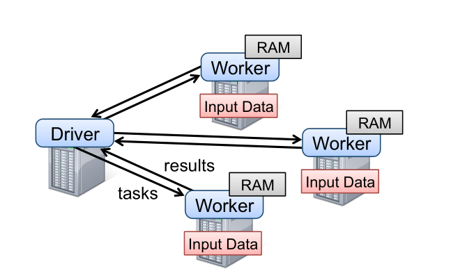
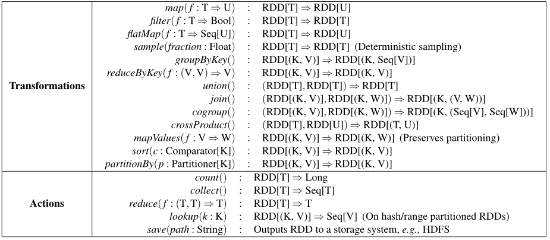
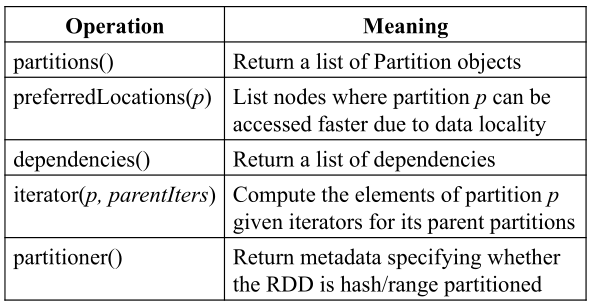

RDD全称：Resilient Distributed Datasets，弹性分布式数据集（容错的内存集群计算抽象）

摘要：

RDD的动机：两种应用类型，iterative algorithms 和 interactive data mining tools，放在内存将更快

粗粒度（coarse-grained）转换


## Introduction

`Mapreduce` 和 `Dryad` 都是将中间储存在外部存储中，`Pregel` 和 `Haloop` 只能针对特定的应用达到将中间结果放置在内存中 

RDD 达到如下：

* 对广泛的应用达到高效重用数据
* 容错，并行的数据结构
* 可以显性地持久化中间结果到内存中
* 可以显性地控制分区优化数据放置
* 丰富的operator

实现RDD的主要挑战：定义编程（高效容错的）接口

现有的集群内存存储抽象基于细粒度，所以只能通过两种方式容错：

* replicate the data across machines（冗余存储）
* log updates across machines（记录更新流程）

这样会拷贝大量的数据在集群网络中，而集群网络带宽远低于内存


RDD 提供了基于粗粒度转换的接口，容错方式：log the transformations


## RDD 概览

### RDD 抽象

RDD 只读，分区式的。只能通过确定的操作从以下两种数据创建：

* stable storage
* 其它 RDDs

这种操作成为 `transformation` 。

两个概念：`persistence` 和 `partitioning` 

### Spark编程接口

transformation 和 action：直到执行action时，Spark才开始真的计算

persist：持久化的数据默认放在内存，内存不足时才放在stable storage。也可以指定优先放在硬盘中。

### RDD模型的优点

|           Aspect           |                    RDDs                     |            Distr. Shared Mem.             |
| :------------------------: | :-----------------------------------------: | :---------------------------------------: |
|           Reads            |           Coarse- or fine-grained           |               Fine-grained                |
|           Writes           |               Coarse-grained                |               Fine-grained                |
|        Consistency         |             Trivial(immutable)              |             Up to app/runtime             |
|       Fault recovery       | Fine-grained and low-overhead using lineage | Requires checkpoints and program rollback |
|    Straggler mitigation    |         Possible using backup tasks         |                 Difficult                 |
|       Work placement       |      Automatic based on data locality       | Up to app (runtimes aim for transparency) |
| Behavior if not enough RAM |    Similar to existing data flow systems    |             Poor performance              |

RDD 的好处：

* 不用 checkpoints 的代价（用lineage生成），出错的时候只需要计算错误的分区
* 通过运行慢速的任务的备份副本来缓解慢速结点问题
* 根据数据的位置调度 task
* 如果没有足够的内存，可以把中间结果放到硬盘中，然后持有与Mapreduce相近的性能

不适合RDD的应用：异步细粒度更新，例如Web应用的存储系统


## Spark 编程接口

driver program




* Scala将每个闭包表示为Java对象，

* 并且这些对象可以序列化并加载到另一个节点上，以通过网络传递闭包。 

* Scala还将闭包中绑定的所有变量另存为Java对象中的字段。

  例如，可以编写类似 ``var x = 5` 的代码； `rdd.map(_ + x)` 将5添加到RDD的每个元素中。

### RDD 操作



注意：

* join只对 key-value 可用
* 这里的函数名尽量与 Scala 的 API 匹配。


### 两个例子：LR 和 PageRank

* Logistic Regression

  ```scala
  val points = spark.textFile(...)
                    .map(parsePoint).persist()
  var w = // random initial vector
  for (i <- 1 to ITERATIONS) {
    val gradient = points.map{ p =>
      p.x * (1/(1+exp(-p.y*(w dot p.x)))-1)*p.y
    }.reduce((a,b) => a+b)
    w -= gradient
  }
  ```

  

* PageRank

  ```scala
  val links = spark.textFile(...).map(...).persist()
  var ranks = // RDD of (URL, rank) pairs
  for (i <- 1 to ITERATIONS) {
    // Build an RDD of (targetURL, float) pairs
    // with the contributions sent by each page
    val contribs = links.join(ranks).flatMap {
      (url, (links, rank)) =>
        links.map(dest => (dest, rank/links.size))
    }
    // Sum contributions by URL and get new ranks
    ranks = contribs.reduceByKey((x,y) => x+y)
              .mapValues(sum => a/N + (1-a)*sum)
  }
  ```

  

## RDD 的表示

简单基于图的方式

通过一个公共接口表示每个RDD，该接口暴露了5个info：

* partitions, atomic pieces of the dataset
* dependencies on parent RDDs
* function for computing the dataset
* metadata about its partitioning scheme and data placement



依赖关系分为两种：

* narrow dependencies：父RDD的每个分区只被一个子RDD的计算使用
* wide dependencies：一个父RDD被多个子RDD依赖

两个原因：

* narrow 依赖可以在一个集群结点上 pipeline 执行
* narrow 依赖在结点出错后很容易恢复，只需计算一部分parent RDD


上图函数解释（HDFS中，block是HDFS的块）：

* `partitions` 返回每个文件`block`为一个分区（block的偏移放在`Partition`对象中）

* `preferredLocations` 返回`block`所在的`node`

* `iterator` 读取 `block`

一些算子：

* map：对任意的RDD输入返回一个 MappedRDD 对象，与parents有相同的 partitions 和 preferred locations。通过iterator方法使用map
* union
* sample
* join


## 实现


### Job Scheduling

* 调度器与 Dryad 的相近，但也考虑了分区的persist

* 每个stage尽可能包含足够多的narrow dependencies

* 对于 wid dependencies(i.e. shuffle dependencies)，类似于MapReduce，先在父分区所在的结点上记录中间结果

* 如果 task 失败，如果stage的父分区可用，则在其它结点上重新执行；否则重新提交task去计算


### Interpreter Integration

对解释器做两个改变：

* Class shipping：通过HTTP服务这些类
* Modified code generation：由于worker结点不能通过原来的reference找到前面的对象，所以需要修改reference的生成部分


### Memory Management

Spark提供三种存储持久化RDD的选择：

* 作为序列化的 Java 对象在内存中储存（最快）
* 作为序列化 data 在内存中储存（当内存受限时，可选一种节省空间的表示方式）
* 在硬盘上（内存受限时）

采取LRU替换策略，驱逐内存中最近最少使用的分区

这一段没看懂

```
When a new RDD partition is computed but there is not enough space to store it, we evict a partition from the least recently ac- cessed RDD, unless this is the same RDD as the one with the new partition. In that case, we keep the old partition in memory to prevent cycling partitions from the same RDD in and out. 
```

向用户提供了“优先持久化”控制


### 支持 Checkpinting

如果计算的 lineage chain 太长，checkpoint 一些 RDD 是一个好的选择。

一般地，checkpoint 对 wide dependencied 比较有效。


## Evaluation