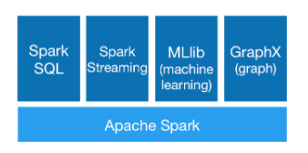
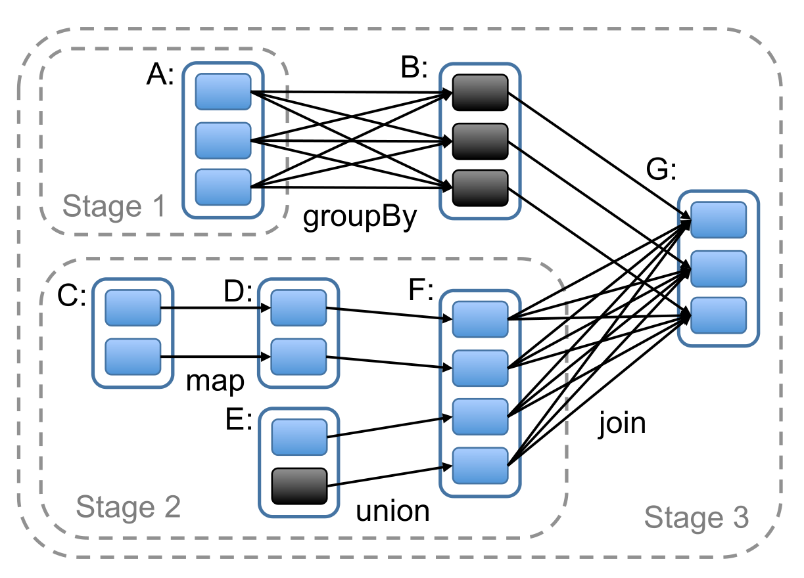
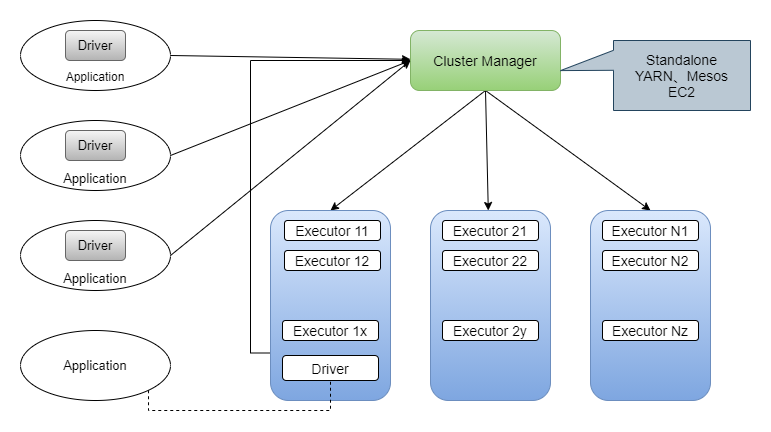

## Spark 基础知识                

阅读spark的论文：https://www.usenix.org/conference/nsdi12/technical-sessions/presentation/zaharia

## 模块设计

Spark 主要由Spark Core、Spark SQL、Spark Streaming、MLlib和GraphX组成，各模块依赖图如下：

### Spark核心功能

Spark Core 的功能如下：

__（1）基础设施__ 

* SparkConf：管理Spark应用程序的各种配置信息
* Spark内置的RPC框架：跨机器节点不同组件间的通信
* 事件总线：SparkContext内部各个组件间使用事件——监听器模式调用的实现
* 度量系统

__（2）SparkContext__

SparkContext隐藏了：网络通信、分布式部署、消息通信、存储体系、计算引擎、度量系统、文件服务、WebUI

__（3）SparkEnv__

**（4）存储体系**

**（5）调度系统**

* DAGScheduler
  * 创建Job
  * 将DAG中的RDD划分到不同的Stage
  * 给Stage创建对应的Task
  * 批量提交Task
* TaskScheduler
  * Task调度
  * 为Task分配资源
  * 将Task发送到发送到集群管理器已经分配给当前应用的Executor上

**（6）计算引擎**

* MemoryManager
* Tungsten
* TaskMemoryManager
* Task
* ExternalSorter
* ShuffleManager

## Spark模型设计

### Spark编程模型

* 用户使用SparkContext提供的API编写Driver应用程序。以下类都对SparkContext进行了封装（has-a）。
  * SparkSession：(org.apache.spark.sql)
  * DataFrame：`type DataFrame = Dataset[Row]`，而 DataSet[T] (org.apache.spark.sql) 
  * SQLContext
  * HiveContext
  * StreamingContext
* 使用 `SparkContext` 提交用户的应用程序
  * 首先会通过 RpcEnv 向集群管理器（Cluster Manager）注册应用（`Application`），并且告知集群管理器需要的资源数量。
    * 集群管理器根据 Application 的需求，给 Application 分配 `Executor` 资源，
    * 并在 Worker 上启动 CoarseGrainExecuterBackend 进程（该进程内部创建 Executor ）。
    * Executor 所在的 CoarseGrainedExecutorBackend 进程在启动的过程中将通过 RpcEnv 直接向 Driver 注册 Executor 的资源信息。
  * TaskScheduler 将保存已经分配给 Application 的Executor 资源的地址、大小等相关信息。
  * SparkContext 根据各种转换 API，构建 RDD 之间的血缘关系和DAG，RDD构成的DAG将最终提交给 DAGScheduler。
    * DAGScheduler 给提交的 DAG 创建 Job，并根据 RDD 的依赖性质将 DAG 划分为不同的 Stage。
    * DAGScheduler 给提交的 Stage 内 RDD 的 Partition 数量创建多个 Task 并批量提交给 TaskScheduler。
  * TaskScheduler 对批量的 Task 按照 FIFO 或 FAIR 调度算法进行调度
    * 然后给 Task 分配 Executor 资源
    * 最后将 Task 发送给 Executor ，由 Executor 执行。
  * 此外，SparkContext 还会在 RDD 转换开始之前使用 BlockManager 和 BroadcastManager 将任务的 Hadoop 配置进行广播。
* 集群管理器（Cluster Manager）会根据应用的需求，给应用分配资源，即将具体任务分配到不同的Worker结点上的多个Executor来处理任务的运行。可以作为Spark的集群管理器
  * Standalone
  * YARN
  * Mesos
  * EC2
* Task 在运行的过程中需要对一些数据（如中间结果、Checkpoint等）进行持久化，Spark 支持的存储方式包括且不止一下：
  * HDFS
  * Amazon S3
  * Alluxio

### RDD 计算模型

上图展示了A、B、C、D、E、F、G 一共7个RDD。每个 RDD 中的小块代表一个分区，将会有一个Task处理此分区的数据。

* map 和 union 生成的 RDD 与其上游 RDD 之间的依赖是 NarrowDependency
* groupByKey 和 join 生成的 RDD 与其上游的 RDD 之间的依赖是 ShuffleDependency
* DAGShceduler 按照 ShuffleDependency 作为 Stage 的划分的依据。

## Spark 基本架构

（1）Cluster Manager

Spark 的集群管理器，主要负责整个集群资源的分配和管理。Cluster Manager 在

* YARN部署模式下为 ResourceManager
* Mesos部署模式下为 Mesos Master
* Standalone 部署模式下为 Master

Cluster Manager 分配的资源为一级分配，它将各个 Worker 上的内存、CPU等资源分配给Application，但是并不负责对 Executor 的资源分配。Standalone部署模式下的Master会直接给Application分配内存、CPU 及 Executor 等资源。

（2）Worker

Spark的工作结点。在YARN部署模式下由NodeManager 替代。Worker结点主要负责：

* 将自己的内存、CPU等资源通过注册机制告知Cluster Manager
* 创建 Executor
* 将资源和任务进一步分配给 Executor
* 同步资源信息、Executor 状态信息给Cluster Manager

Standalone部署模式下，Master 将Worker 上的内存 、CPU及Executor 等资源分配给Application后，将命令 Worker 启动 CoasreGrainedExecutorBackend 进程（此进程会创建 Executor 实例）。

（3）Executor

执行计算任务的一线组件。

（4）Driver

Application 的驱动程序，Application 通过 Driver 与 Cluster Manager、Executor 进行通信。Driver 可以运行在Application 中，也可以由Application 提交给 Cluster Manager 并由 Cluster Manager 安排 Worker 运行。

（5）Application

用户使用 Spark 提供的 API 编写的应用程序。