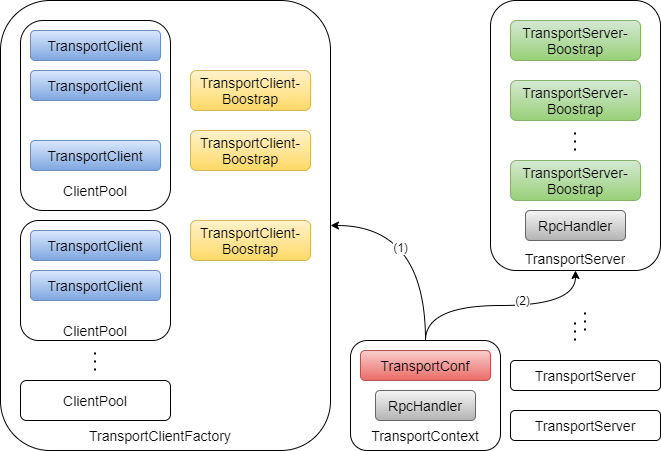

# Spark 基础设施（一）

## Spark 配置

SparkConf 是 Spark 的配置类，Spark 中的每一个组件都直接或间接地使用着它所存储的属性，这些属性存储在 `settings` 变量中。下面是 SparkConf  定义的代码段：

目录地址： `src/main/scala/org/apache/spark/SparkConf.scala`

```scala
class SparkConf(loadDefaults: Boolean) extends Cloneable with Logging with Serializable {

  import SparkConf._

  /** Create a SparkConf that loads defaults from system properties and the classpath */
  def this() = this(true)

  private val settings = new ConcurrentHashMap[String, String]()
  /* ... */
}
```

Spark 的所有配置都是 key 和 value 都是 String 类型。Spark 的配置有 3 种方式获取

* 来源于系统参数中以 spark. 作为前缀的那部分属性
* 使用 SparkConf 的 API 进行设置
* 从其他 SparkConf 中克隆


### 系统属性中的配置

SparkConf 中代码段

```scala
  if (loadDefaults) {
    loadFromSystemProperties(false)
  }

  private[spark] def loadFromSystemProperties(silent: Boolean): SparkConf = {
    // Load any spark.* system properties
    for ((key, value) <- Utils.getSystemProperties if key.startsWith("spark.")) {
      set(key, value, silent)
    }
    this
  }
```

上面所示用的 set 函数如下：

```scala
  private[spark] def set(key: String, value: String, silent: Boolean): SparkConf = {
    if (key == null) {
      throw new NullPointerException("null key")
    }
    if (value == null) {
      throw new NullPointerException("null value for " + key)
    }
    if (!silent) {
      logDeprecationWarning(key)
    }
    settings.put(key, value)
    this
  }
```


### 使用 SparkConf 配置的 API

```scala
  /** Set a configuration variable. */
  def set(key: String, value: String): SparkConf = {
    set(key, value, false)
  }
```

这里的 set 使用了上面的 set 方法，SparkConf 还给出了针对具体属性的设置的 set 函数，都是调用上面的 set 方法。以最为常用的 setMaster 和 setAppName 为例：

```scala
 /**
   * The master URL to connect to, such as "local" to run locally with one thread, "local[4]" to
   * run locally with 4 cores, or "spark://master:7077" to run on a Spark standalone cluster.
   */
  def setMaster(master: String): SparkConf = {
    set("spark.master", master)
  }

  /** Set a name for your application. Shown in the Spark web UI. */
  def setAppName(name: String): SparkConf = {
    set("spark.app.name", name)
  }
```


### 克隆 SparkConf 配置

SparkConf 继承了 Cloneable 特质并实现了 clone 方法，clone 方法如下：

```scala
  /** Copy this object */
  override def clone: SparkConf = {
    val cloned = new SparkConf(false)
    settings.entrySet().asScala.foreach { e =>
      cloned.set(e.getKey(), e.getValue(), true)
    }
    cloned
  }
```


## Spark 内置 RPC 框架

下图是 RPC 框架的基本架构：



图中元素解释：

* TransportContext 
  * TransportConf：TransportContext 的配置信息
  * RpcHandler：对客户端请求进行处理的 RpcHandler
  * TransportConf 用在创建TransportClientFactory 和 TransportServer；而RpcHandler 只用于创建 TransportServer
* TransportClientFactory：客户端的工厂类
* TransportServer：RPC 服务端的实现
* 箭头（1）：通过调用 TransportContext 的 `createClientFactory` 方法创建用于传输的客户端工厂 `TransportClientFactory` 的实例。在构造 `TransportClientFactory` 的实例时，还会传递客户端引导程序 `TransportClientBoostrap` 的列表。此外，TransportClientFactory 内部还存在针对每个 Socket 地址的连接池 ClientPool，定义如下：

```java
  private final ConcurrentHashMap<SocketAddress, ClientPool> connectionPool;
```

ClientPool 的定义（TransportClientFactory的私有类）如下：

```java
  /** A simple data structure to track the pool of clients between two peer nodes. */
  private static class ClientPool {
    TransportClient[] clients;
    Object[] locks;

    ClientPool(int size) {
      clients = new TransportClient[size];
      locks = new Object[size];
      for (int i = 0; i < size; i++) {
        locks[i] = new Object();
      }
    }
  }
```

* 箭头（2）表示通过调用 TransportContext 的 createServer 方法创建传输服务端 TransportServer 的实例。

```java
  /** Create a server which will attempt to bind to a specific port. */
  public TransportServer createServer(int port, List<TransportServerBootstrap> bootstraps) {
    return new TransportServer(this, null, port, rpcHandler, bootstraps);
  }

  /** Create a server which will attempt to bind to a specific host and port. */
  public TransportServer createServer(
      String host, int port, List<TransportServerBootstrap> bootstraps) {
    return new TransportServer(this, host, port, rpcHandler, bootstraps);
  }

  /** Creates a new server, binding to any available ephemeral port. */
  public TransportServer createServer(List<TransportServerBootstrap> bootstraps) {
    return createServer(0, bootstraps);
  }

  public TransportServer createServer() {
    return createServer(0, new ArrayList<>());
  }
```


Spark 的 RPC 框架所包含的各个组件：

* TransportContext
* TransportConf
* RpcHandler
* MessageEncoder
* MessageDecoder
* TransportFrameDecoder
* RpcResponseCallback
* TransportClientFactory
* ClientPool


### RPC 配置 TransportConf

TransportConf 有实例配置提供者 conf 和 配置的模块名称 module。两个属性定义如下：

```java
  private final ConfigProvider conf;

  private final String module;
```

ConfigProvider 的实现：

```java
public abstract class ConfigProvider {
  /** Obtains the value of the given config, throws NoSuchElementException if it doesn't exist. */
  public abstract String get(String name);

  /** Returns all the config values in the provider. */
  public abstract Iterable<Map.Entry<String, String>> getAll();

  public String get(String name, String defaultValue) {
    try {
      return get(name);
    } catch (NoSuchElementException e) {
      return defaultValue;
    }
  }

  public int getInt(String name, int defaultValue) {
    return Integer.parseInt(get(name, Integer.toString(defaultValue)));
  }

  public long getLong(String name, long defaultValue) {
    return Long.parseLong(get(name, Long.toString(defaultValue)));
  }

  public double getDouble(String name, double defaultValue) {
    return Double.parseDouble(get(name, Double.toString(defaultValue)));
  }

  public boolean getBoolean(String name, boolean defaultValue) {
    return Boolean.parseBoolean(get(name, Boolean.toString(defaultValue)));
  }

}
```

Spark 通常使用 SparkTransportConf (src/main/scala/org/apache/spark/network/netty/SparkTransportConf.scala) 创建 TransportConf：

```scala
 */
object SparkTransportConf {  
  def fromSparkConf(
      _conf: SparkConf,
      module: String,
      numUsableCores: Int = 0,
      role: Option[String] = None): TransportConf = {
    val conf = _conf.clone
    val numThreads = NettyUtils.defaultNumThreads(numUsableCores)
    Seq("serverThreads", "clientThreads").foreach { suffix =>
      val value = role.flatMap { r => conf.getOption(s"spark.$r.$module.io.$suffix") }
        .getOrElse(
          conf.get(s"spark.$module.io.$suffix", numThreads.toString))
      conf.set(s"spark.$module.io.$suffix", value)
    }

    new TransportConf(module, new ConfigProvider {
      override def get(name: String): String = conf.get(name)
      override def get(name: String, defaultValue: String): String = conf.get(name, defaultValue)
      override def getAll(): java.lang.Iterable[java.util.Map.Entry[String, String]] = {
        conf.getAll.toMap.asJava.entrySet()
      }
    })
  }
}
```

将线程数用于设置客户端和服务端传输线程数（`s"spark.$module.io.$suffix"`），


### RPC 客户端工厂 TransportClientFactory

TransportContext 创建 TransportClientFactory：

```java
  public TransportClientFactory createClientFactory(List<TransportClientBootstrap> bootstraps) {
    return new TransportClientFactory(this, bootstraps);
  }

  public TransportClientFactory createClientFactory() {
    return createClientFactory(new ArrayList<>());
  }
```

TransportClientFactory 的构造器：

```java
  public TransportClientFactory(
      TransportContext context,
      List<TransportClientBootstrap> clientBootstraps) {
    this.context = Preconditions.checkNotNull(context);
    this.conf = context.getConf();
    this.clientBootstraps = Lists.newArrayList(Preconditions.checkNotNull(clientBootstraps));
    this.connectionPool = new ConcurrentHashMap<>();
    this.numConnectionsPerPeer = conf.numConnectionsPerPeer();
    this.rand = new Random();

    IOMode ioMode = IOMode.valueOf(conf.ioMode());
    this.socketChannelClass = NettyUtils.getClientChannelClass(ioMode);
    this.workerGroup = NettyUtils.createEventLoop(
        ioMode,
        conf.clientThreads(),
        conf.getModuleName() + "-client");
    if (conf.sharedByteBufAllocators()) {
      this.pooledAllocator = NettyUtils.getSharedPooledByteBufAllocator(
          conf.preferDirectBufsForSharedByteBufAllocators(), false /* allowCache */);
    } else {
      this.pooledAllocator = NettyUtils.createPooledByteBufAllocator(
          conf.preferDirectBufs(), false /* allowCache */, conf.clientThreads());
    }
    this.metrics = new NettyMemoryMetrics(
      this.pooledAllocator, conf.getModuleName() + "-client", conf);
  }
```

各个变量解释：

* context：参数传递的 TransportContext 的 引用
* conf：指 TransportConf，这里通过调用 TransportContext 的getConf 获取
* clientBootstraps：参数传递的 TransportClientBootstrap 列表
* connectionPool：针对每个 Socket 地址的连接池 ClientPool 的缓存（ConcurrentHashMap 类型）。

