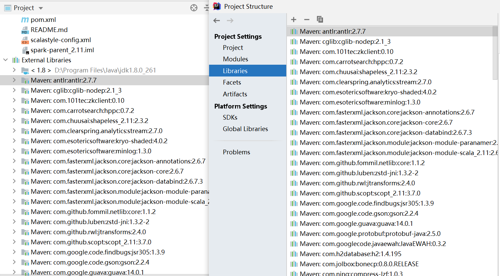
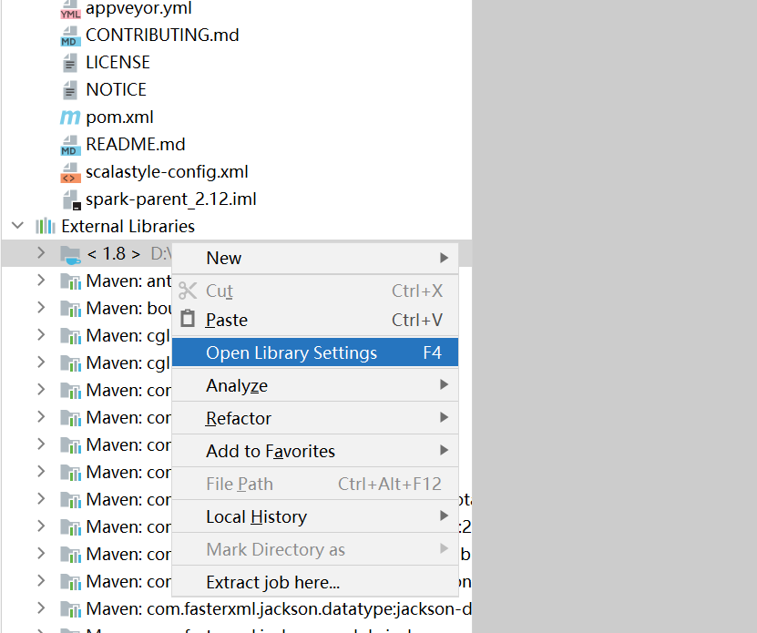
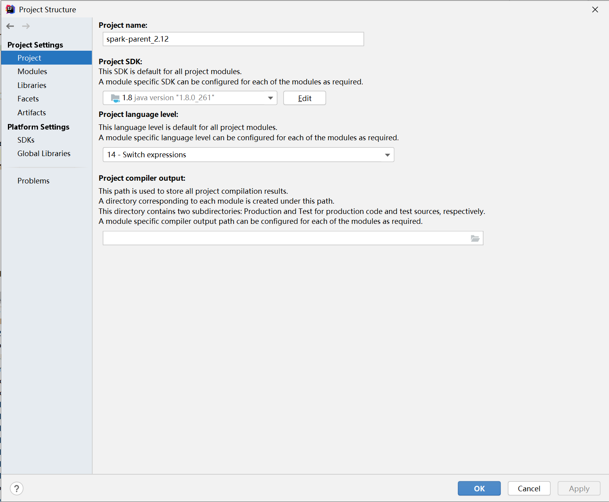
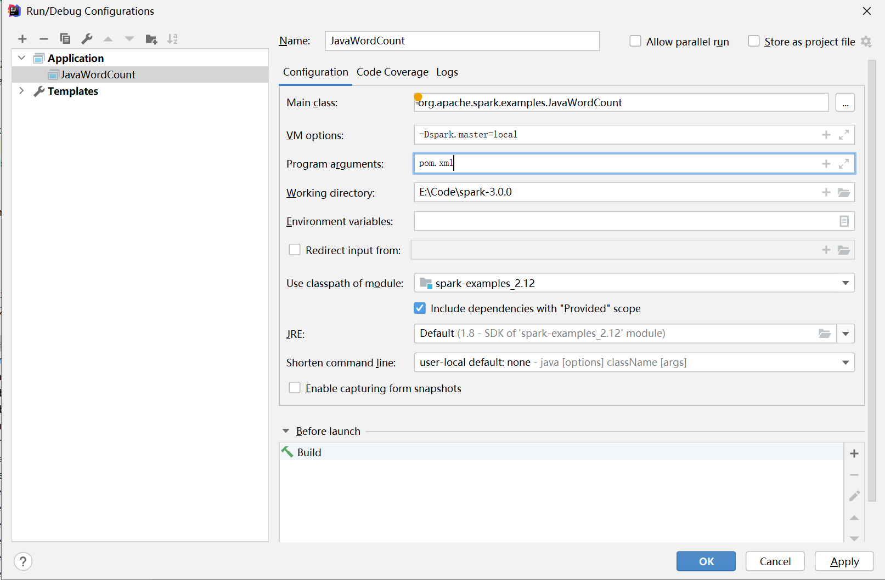
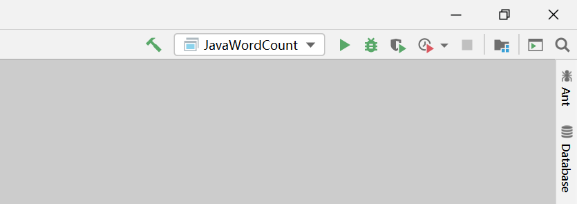

# Spark 测试

假设编译好了 spark 3.0.0


## 导入

* 编译完成后，现在就可以导入到IDEA里面了，直接点击 `Open or Import`

  

  或者进入工作界面后点击`Open...` 

* 找到 spark 目录下的 pom.xml 文件，点击，再点击 `Open as Project`

  

* 等待解析导入文件 ... （这里需要等带一段时间）。最终成功


## 配置

### 修改 Maven 配置

换成编译时候所使用的 maven 版本，点击 File $\rightarrow$ Setting，然后找到如下栏目，修改右边的 Maven home directory，只需要点击三角形标志就可以切换。


__注意：__ 查看 Maven 库是否在里面（这个我也不明白）：




### 修改 JDK 配置

* 点击 jdk，右键，然后点击 `Open Library Settings`




* 点击 Project Settings 下面的 Project，更改右边界面的 Project SDK下面的jdk，最后点击 `OK` 。




### 设置执行参数和运行例子

这里执行一个 JavaWordCount 的例子，这是一个统计单词个数的 Java程序。

* 点击 Run $\rightarrow$ Edit configurations，点击左侧上方的加号 `+` ，然后点击点击 `Application`
* 修改右边如下，分别是：
  * Name：随便，比如 JavaWordCount
  * 设置 Use classpth of module为 spark-example_2.12，然后点击下方的 Include dependencies...
  * Main class，点击`...`，找到（或者直接输入）：org.apache.spark.examples.JavaWordCount
  * JRE：java运行环境为1.8 version
  * VM options：-Dspark.master=local，表示本地模式。
  * Program arguments：例如pom.xml，也可以指定其它文件，统计这个文件里面的单词个数。




* 最后点击 OK，回到工作界面，可以看到右上角有JavaWordCount这个应用程序（Application）配置好了，点击绿色三角形执行。




## 执行结果

点击执行后，开始编译执行，等待一段时间结果出来：

```
Using Spark's default log4j profile: org/apache/spark/log4j-defaults.properties
20/08/20 11:21:51 INFO SparkContext: Running Spark version 3.0.0
20/08/20 11:21:51 WARN NativeCodeLoader: Unable to load native-hadoop library for your platform... using builtin-java classes where applicable
20/08/20 11:21:51 INFO ResourceUtils: ==============================================================
20/08/20 11:21:51 INFO ResourceUtils: Resources for spark.driver:

20/08/20 11:21:51 INFO ResourceUtils: ==============================================================
20/08/20 11:21:51 INFO SparkContext: Submitted application: JavaWordCount
20/08/20 11:21:51 INFO SecurityManager: Changing view acls to: YUANYIN
20/08/20 11:21:51 INFO SecurityManager: Changing modify acls to: YUANYIN
20/08/20 11:21:51 INFO SecurityManager: Changing view acls groups to: 
20/08/20 11:21:51 INFO SecurityManager: Changing modify acls groups to: 
20/08/20 11:21:51 INFO SecurityManager: SecurityManager: authentication disabled; ui acls disabled; users  with view permissions: Set(YUANYIN); groups with view permissions: Set(); users  with modify permissions: Set(YUANYIN); groups with modify permissions: Set()
20/08/20 11:21:53 INFO Utils: Successfully started service 'sparkDriver' on port 51315.
20/08/20 11:21:53 INFO SparkEnv: Registering MapOutputTracker
20/08/20 11:21:53 INFO SparkEnv: Registering BlockManagerMaster
```

里面有一堆【INFO】和一个不能load hadoop 的【WARN】。

往下翻可以看到结果：

```
20/08/20 11:22:00 INFO DAGScheduler: Job 0 finished: collect at JavaWordCount.java:53, took 1.933393 s
Unless: 1
<artifactId>derby</artifactId>: 1
<module>common/kvstore</module>: 1
<module>external/kinesis-asl-assembly</module>: 1
gives.: 1
<scalaVersion>${scala.version}</scalaVersion>: 1
<groupId>net.alchim31.maven</groupId>: 2
```

左边是单词，是以空格划分单词的。右边是个数。