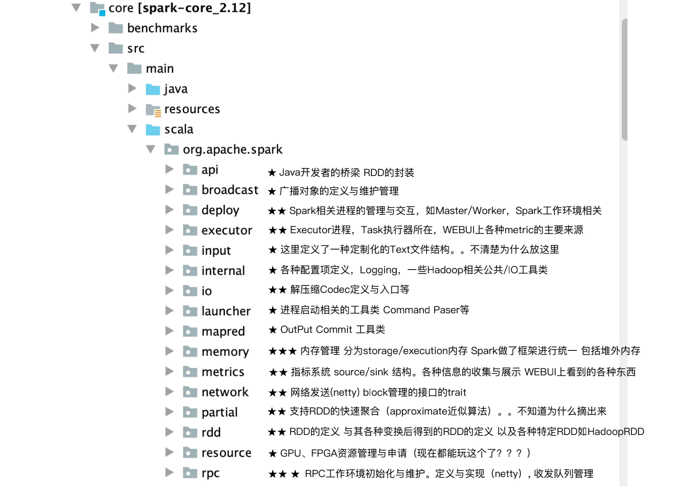
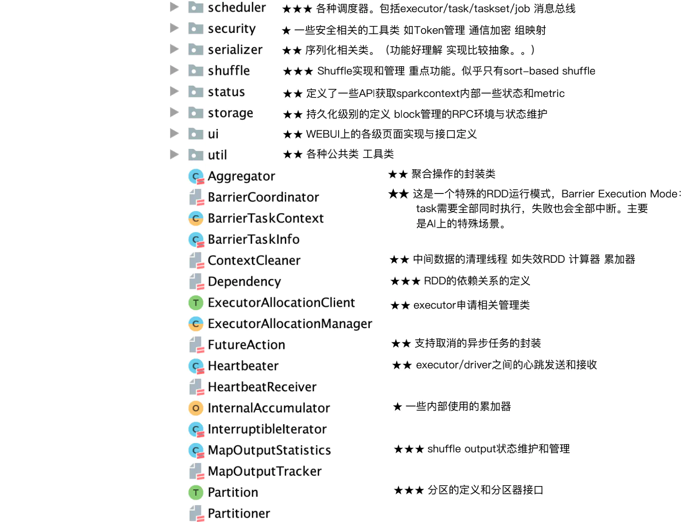
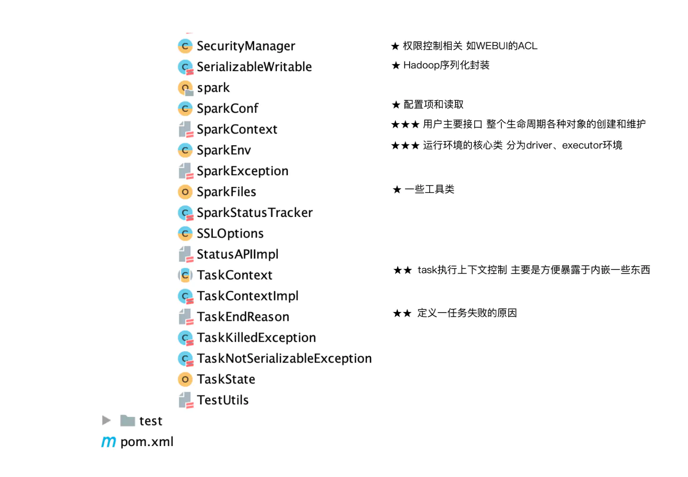

# Spark 源码结构

Spark 关键目录

| 目录      | 功能                                  |
| --------- | ------------------------------------- |
| core      | Spark 核心代码                        |
| sql       | Spark sql 相关的代码                  |
| streaming | Spark Streaming（实时计算）相关的代码 |
| mlib      | MLib（机器学习）相关代码              |
| graphx    | GraphX（图计算）相关代码              |
| yarn      | 支持 Spark 运行在 Yarn 上的模块       |
| examples  | 各种 Spark 作业的示例                 |

非关键目录：

| 目录     | 功能                 |
| -------- | -------------------- |
| assembly | 组装spark项目的地方  |
| external | 与一些外部系统的依赖 |
| repl     | Spark shell 功能模块 |
| tools    | 工具包               |

## Spark Core

按个人理解的重要程度，分为：

 ★ 辅助类，不重要 ，帮助框架能跑，如配置相关。

 ★ ★ 串连与实现，整个代码的血肉，组成最多的部分，如RPC收发，Block管理。

 ★ ★ ★ 核心概念与框架的定义，计算的源头与驱动，如RDD定义与TaskSet/Job调度。

### Spark Core 源码全景

