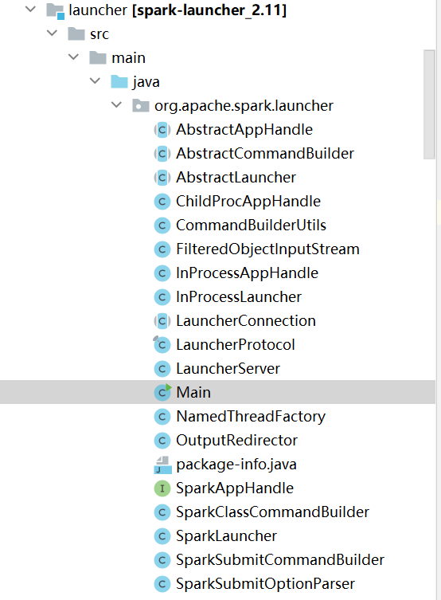

## spark-submit 阅读

### 阅读总结

__阅读顺序__

* 先阅读 __spark-submit__ ，中间有跳到 find-spark-home。最后用 spark-class 执行程序。
* __spark-class__（执行开始class），中间跳到 load-spark-env（检测一些环境，包括jdk等）


__了解的信息__

* 一开始先执行 `org.apache.spark.deploy.SparkSubmit` 类
* Spark的 jar 包放在 `/assembly/target/scala-x.x/jars` 中
* `org.apache.spark.deploy.SparkSubmit` 目录： `core\src\main\scala\org\apache\spark\deploy\SparkSubmit.scala`
* `org.apache.spark.launcher.Main` 类的目录： `launcher\src\main\java\org\apache\spark\launcher\Main.java`



* 最后执行的命令

  ```shell
  CMD=("${CMD[@]:0:$LAST}")
  ## 翻译就是
  java -Xmx${memoryMb}M -cp org.apache.spark.deploy.SparkSubmit para1, ...
  ```

  

### spark-submit.sh

```shell
#!/usr/bin/env bash
# ...
if [ -z "${SPARK_HOME}" ]; then              # 若是否设置了spark_home环境变量，-z 表示长度是否为零
  source "$(dirname "$0")"/find-spark-home   # 没有则在当前目录下运行 find-spark-home 脚本
fi

# disable randomized hash for string in Python 3.3+
export PYTHONHASHSEED=0                      # 不懂

exec "${SPARK_HOME}"/bin/spark-class org.apache.spark.deploy.SparkSubmit "$@" 
# 用./bin/spark-class 执行 SparkSubmit 类，$@ 表示输入构成的数组
```


### find-spark-home

```shell
#!/usr/bin/env bash

FIND_SPARK_HOME_PYTHON_SCRIPT="$(cd "$(dirname "$0")"; pwd)/find_spark_home.py" # 一个.py文件

# 重新检测一次有无设置 spark_home 环境变量
if [ ! -z "${SPARK_HOME}" ]; then          
   exit 0
elif [ ! -f "$FIND_SPARK_HOME_PYTHON_SCRIPT" ]; then  
	# !是取反, -f 测试是否为文件
	# 这表示这个 .py 文件没有在该目录时，值为真
  export SPARK_HOME="$(cd "$(dirname "$0")"/..; pwd)" # 设置 spark_home 为上层目录
else                                                  # 有 .py 文件时，则换一个启动目录，这个可以不理
  if [[ -z "$PYSPARK_DRIVER_PYTHON" ]]; then
     PYSPARK_DRIVER_PYTHON="${PYSPARK_PYTHON:-"python"}"
  fi
  export SPARK_HOME=$($PYSPARK_DRIVER_PYTHON "$FIND_SPARK_HOME_PYTHON_SCRIPT")
fi
```


### spark-class

```shell
#!/usr/bin/env bash

### 同上，设置 spark_home 环境变量
if [ -z "${SPARK_HOME}" ]; then
  source "$(dirname "$0")"/find-spark-home
fi

. "${SPARK_HOME}"/bin/load-spark-env.sh  # 执行 load-spark-env.sh

### 找到 java 库
if [ -n "${JAVA_HOME}" ]; then
  RUNNER="${JAVA_HOME}/bin/java"
else
  if [ "$(command -v java)" ]; then
    RUNNER="java"
  else
    echo "JAVA_HOME is not set" >&2
    exit 1
  fi
fi

### 找到 Spark 的jar包.
if [ -d "${SPARK_HOME}/jars" ]; then
  SPARK_JARS_DIR="${SPARK_HOME}/jars"
else
  SPARK_JARS_DIR="${SPARK_HOME}/assembly/target/scala-$SPARK_SCALA_VERSION/jars"
fi

# 检查这个名称是否为目录，然后设置该目录为环境变量LAUNCH_CLASSPATH
if [ ! -d "$SPARK_JARS_DIR" ] && [ -z "$SPARK_TESTING$SPARK_SQL_TESTING" ]; then
  echo "Failed to find Spark jars directory ($SPARK_JARS_DIR)." 1>&2
  echo "You need to build Spark with the target \"package\" before running this program." 1>&2
  exit 1
else
  LAUNCH_CLASSPATH="$SPARK_JARS_DIR/*"
fi

# 可能有其它指定的类库，加进去
if [ -n "$SPARK_PREPEND_CLASSES" ]; then # 判断有无指定的类库
  LAUNCH_CLASSPATH="${SPARK_HOME}/launcher/target/scala-$SPARK_SCALA_VERSION/classes:$LAUNCH_CLASSPATH"
fi

# 如果是测试(这里可能是编译时候的测试)，则删除两个环境变量
if [[ -n "$SPARK_TESTING" ]]; then
  unset YARN_CONF_DIR
  unset HADOOP_CONF_DIR
fi

# $RUNNER 是 java，用java执行org.apache.spark.launcher.Main类
build_command() {                
  "$RUNNER" -Xmx128m -cp "$LAUNCH_CLASSPATH" org.apache.spark.launcher.Main "$@"
  printf "%d\0" $?                 # $? 表示运行返回值, $?=0表示运行失败
}

# Turn off posix mode since it does not allow process substitution
set +o posix
CMD=()
while IFS= read -d '' -r ARG; do   # 这个循环接受build_commad的结果，然后拆解成数组放在了CMD，里面追加了返回值
  CMD+=("$ARG")                    #
done < <(build_command "$@")       # 执行函数，将返回结果送给 while 循环, 这个结果参考下面的java代码分析

COUNT=${#CMD[@]}                   # 记录CMD参数个数, CMD[@]表示整个数组
LAST=$((COUNT - 1))                # 找到最后一个参数位置，也就是个数-1
LAUNCHER_EXIT_CODE=${CMD[$LAST]}   # 记下最后的参数，也就是上面执行的返回值

# Certain JVM failures result in errors being printed to stdout (instead of stderr), which causes
# the code that parses the output of the launcher to get confused. In those cases, check if the
# exit code is an integer, and if it's not, handle it as a special error case.
# 如果上面运行正确，输出
if ! [[ $LAUNCHER_EXIT_CODE =~ ^[0-9]+$ ]]; then
  echo "${CMD[@]}" | head -n-1 1>&2
  exit 1
fi
# 如果上面运行出错
if [ $LAUNCHER_EXIT_CODE != 0 ]; then
  exit $LAUNCHER_EXIT_CODE
fi
# 最终执行命令，也就是SparkSubmit类执行
CMD=("${CMD[@]:0:$LAST}")
exec "${CMD[@]}"

```

* `launcher\src\main\java\org\apache\spark\launcher\Main.java`

```java
  private static List<String> buildCommand(
      AbstractCommandBuilder builder,
      Map<String, String> env,
      boolean printLaunchCommand) throws IOException, IllegalArgumentException {
      
    List<String> cmd = builder.buildCommand(env);          // 这是返回的命令，具体看下面代码
    if (printLaunchCommand) {
      System.err.println("Spark Command: " + join(" ", cmd));
      System.err.println("========================================");
    }
    return cmd;
  }
```

* `launcher\src\main\java\org\apache\spark\launcher\AbstractCommandBuilder.java`

```java
  abstract List<String> buildCommand(Map<String, String> env)
      throws IOException, IllegalArgumentException;


```

* launcher\src\test\java\org\apache\spark\launcher\SparkSubmitCommandBuilderSuite.java

```java
private[spark] class WorkerCommandBuilder(sparkHome: String, memoryMb: Int, command: Command)
    extends AbstractCommandBuilder {

  childEnv.putAll(command.environment.asJava)
  childEnv.put(CommandBuilderUtils.ENV_SPARK_HOME, sparkHome)

  override def buildCommand(env: JMap[String, String]): JList[String] = {
    val cmd = buildJavaCommand(command.classPathEntries.mkString(File.pathSeparator))
    cmd.add(s"-Xmx${memoryMb}M")
    command.javaOpts.foreach(cmd.add)
    cmd
  }

  def buildCommand(): JList[String] = buildCommand(new JHashMap[String, String]())

}
```


### load-spark-env.sh

```shell
#!/usr/bin/env bash

# spark-env.sh is loaded from SPARK_CONF_DIR if set, or within the current directory's
# conf/ subdirectory.

# 同上
if [ -z "${SPARK_HOME}" ]; then
  source "$(dirname "$0")"/find-spark-home
fi

# 设置 SPARK_CONF_DIR 为 ./conf
if [ -z "$SPARK_ENV_LOADED" ]; then
  export SPARK_ENV_LOADED=1                                    # 这样就只执行一次该文件

  export SPARK_CONF_DIR="${SPARK_CONF_DIR:-"${SPARK_HOME}"/conf}"

  # 如果 spark-env.sh 文件存在(默认没有，只有模板),则执行它
  if [ -f "${SPARK_CONF_DIR}/spark-env.sh" ]; then
    # Promote all variable declarations to environment (exported) variables
    set -a
    . "${SPARK_CONF_DIR}/spark-env.sh"
    set +a
  fi
fi

# 设置 scala 版本(如果还没设置，可能在spark-env中设置了)
if [ -z "$SPARK_SCALA_VERSION" ]; then

  ASSEMBLY_DIR2="${SPARK_HOME}/assembly/target/scala-2.11"
  ASSEMBLY_DIR1="${SPARK_HOME}/assembly/target/scala-2.12"
  # 有两种版本存在，则出错
  if [[ -d "$ASSEMBLY_DIR2" && -d "$ASSEMBLY_DIR1" ]]; then
    echo -e "Presence of build for multiple Scala versions detected." 1>&2
    echo -e 'Either clean one of them or, export SPARK_SCALA_VERSION in spark-env.sh.' 1>&2
    exit 1
  fi

  if [ -d "$ASSEMBLY_DIR2" ]; then
    export SPARK_SCALA_VERSION="2.11"
  else
    export SPARK_SCALA_VERSION="2.12"
  fi
fi
```


